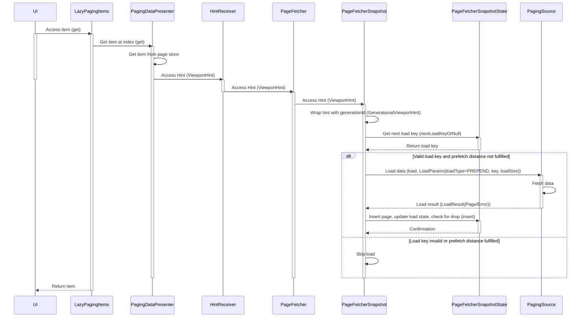
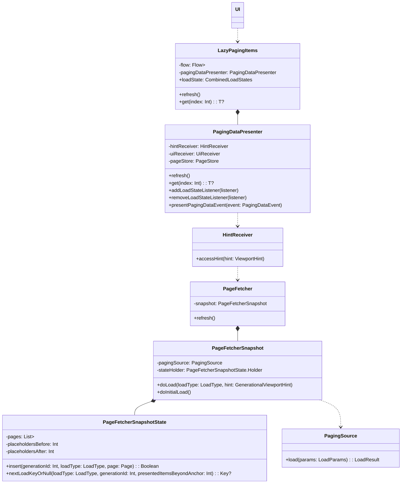

The initial purpose is to understand how the prepend loading in Paging3 is triggered, is it able to manually triggered with flexibility, 
and it extended to get to know the whole lib well.

Although Paging3 is a complicate Android lib with a bunch of classes to do the paging stuff, the NotebookLM helps explain the concept well.
By pasting all the source code to it as context, it explains the concept and the relationship between core classes, and draws the diagram for me.

## Preparation
1. Download all the paging3 source code using https://downgit.github.io/#/home
2. Paging3 common lib source code: https://github.com/androidx/androidx/tree/androidx-main/paging/paging-common/src/commonMain/kotlin/androidx/paging
3. Use copy-files-to-clipboard-for-llm plugin to merge all the files and copy to clipboard
4. Paste the source code to NotebookLM as the reference source
5. Chat with NotebookLM to get explanation and diagrams

## Sequence Diagram

## Core components

